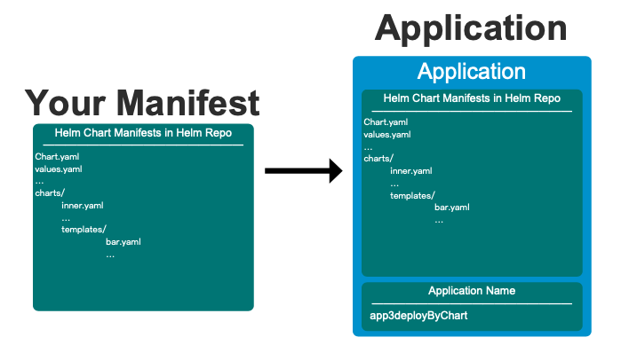
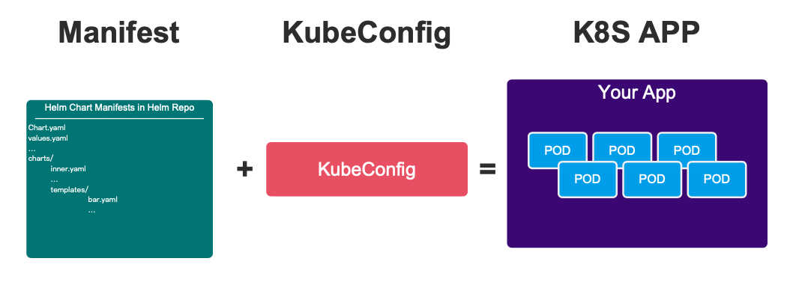
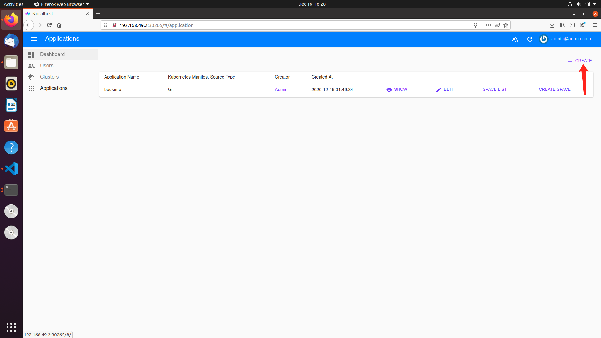
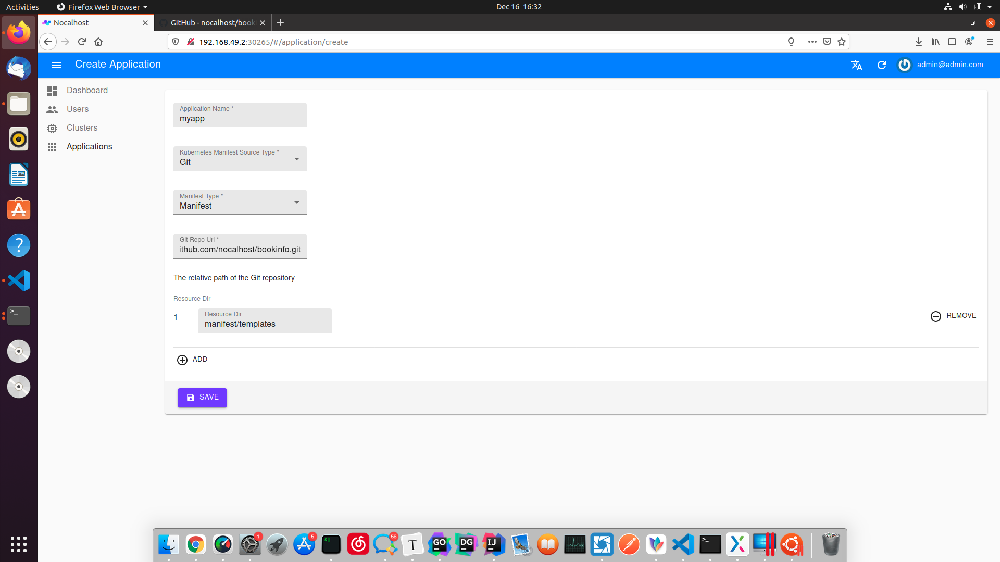

## What is Application

`Application` is a concept of `Nocalhost`, it is mainly used to manage a set of manifest files you want to apply for local development, it supports both k8s manifest and helm chart. In other words, these manifests usually contain all the k8s resources that your own application depends on. If possible, we should try to keep it to a minimum.



`Application` supports the `k8s manifest` or `helm chart` stored in `git` repository, and supports `helm chart` stored in `Helm Repo`. Support for `kustomize` will be added in the future.


## What does Application do

`Application` can be used to create a `DevSpace`, we recommend using IDE plug-in directly to deploy your application, **IDE plug-in is worked on the `DevSpace` created by `Application`**. In other words, after being assigned a `DevSpace`, the developer can easily develop on the IDE.


After being assigned a `DevSpace`, you will get a `kubeconfig` to access this `DevSpace`, `nhctl` or plug-in can deploy the application based on the application's `manifest` file and `kubeconfig`.



So `DevSpace` can actually be approximated as `Application` + `kubeconfig`:


## Application and Manifest

### Support for Helm Manifest

`nocalhost` supports helm and **no need to modify the chart**.


#### 1. If you already own and using Helm Chart:

```
helm install helloworld /chart/dir/ \
   -n fooNamespace \
   --kubeconfig ~/.kube/barconfig
```


It only takes a moment to push your `Helm Chart` to any git repository that you have permission to access. We will use the git clone command to get the latest `Application` information, for example:

```
https://[gihub, Gitlab, etc... whateverRepo]/foo/bar/hellowrold.git

Somefile.py
AClass.java
README.MD
...
mychart/dir/
   Chart.yaml
   values.yaml
   charts/
   templates/
   ...
```

For this repo, the `Helm chart`  is under the `mychart/dir/` **relative to the root directory**, then we can use the following command:

```
nhctl install helloworld \
   -u https://[gihub, Gitlab, etc... whateverRepo]/foo/bar/hellowrold.git \
   -t helmGit \
   -n k8sFooNamespace \
   --resource-path charts/bookinfo \
   --kubeconfig ~/.kube/barconfig
```

#### 2. If you have your own Helm Repo:

```
helm install helloworld \
   mychart \
- repo http://mychart/charts/ \
   -n fooNamespace \
   --kubeconfig ~/.kube/barconfig
```

You can use the following commands to install by `nhctl`:

```
nhctl install helloworld \
   --helm-chart-name mychart \
   --helm-repo-url http://mychart/charts/ \
   -n fooNamespace \
   --kubeconfig ~/.kube/barconfig
```


### Support for Kubernetes Manifest

`nocalhost` can also support `Kubernetes Manifest` without any modification of your manifest, but you still need to push it to any git repository:

Suppose you have such a git repo like this `https://[gihub, Gitlab, etc... whateverRepo]/foo/bar/hellowrold.git`, which contains many `Kubernetes Manifest` files:

```
README.MD
something.java
…
foo/bar/k8s/manifests/
                 foo.yaml
                 pre-install-cm.yaml
                …
                 what/ever/
                               inner.yaml
                               …
                support/all/dir/inside/
                                            bar.yaml
                                            …
```

If you want to apply the files in the relative root directory `what/ever/` and `support/all/dir/inside/`, then use the command:

```
nhctl install applicationNameFooBar \
  -u https://[gihub, Gitlab, etc... whateverRepo]/foo/bar/hellowrold.git \
  -t manifest \
  -n k8sFooNamespace \
  --resource-path what/ever/ \
  --resource-path support/all/dir/inside/ \
  --kubeconfig ~/.kube/barconfig
```

If you want to apply all files, you can use the command:

```
nhctl install applicationNameFooBar \
  -u https://[gihub, Gitlab, etc... whateverRepo]/foo/bar/hellowrold.git \
  -t manifest \
  -n k8sFooNamespace \
  --resource-path. \
  --kubeconfig ~/.kube/barconfig
```


## `Nocalhost` enhancements

`Nocalhost` is non-invasive to the user's k8s manifest. If you want to use some enhancements, such as `Pre-Install`, dependency management, etc. Add the `.nocalhost/` folder in your git repo, with file [config.yaml](https://github.com/nocalhost/bookinfo/blob/main/.nocalhost/config.yaml).


### Pre-Install

We allow users to perform some additional operations before installing applications. Take [bookinfo](https://github.com/nocalhost/bookinfo) as an example, before installing the application, we will execute several jobs as declared below, and wait for the completion of the job execution before installing the application.

```
onPreInstall:
  -path: manifest/templates/pre-install/print-num-job-01.yaml
    weight: "1"
  -path: manifest/templates/pre-install/print-num-job-02.yaml
    weight: "-5"
```


### Start dependency management

`Nocalhost` can control the startup sequence of services in the application.

For example, the following configuration represents the `deployment` of `reviews`, and it will be started after the `pod` of `productpage` is available.

```
services:
  -name: reviews
    serviceType: deployment
    gitUrl: https://github.com/nocalhost/bookinfo-reviews.git
    devContainerImage: codingcorp-docker.pkg.coding.net/nocalhost/dev-images/java:latest
    workDir: /home/nocalhost-dev
    syncDirs:
    -./
    dependPodsLabelSelector:
    -"productpage"
```

You can click [Start Dependency Management](https://nocalhost.dev/Concepts/service/#2-specify-the-startup-sequence-dependency) to see more.


### Develop mirror configuration

In the above configuration, `devContainerImage: codingcorp-docker.pkg.coding.net/nocalhost/dev-images/java:latest` means that when you enter the `Dev-Mode`, use this image as a container instead of the original image for development.


### More

If you want to know more configuration information of `.nocalhost/`, click: [config-yaml-spec](/References/nocalhost-config-yaml-spec/).


## Application best practices

Generally, we recommend using `Nocalhost-Server` + IDE plug-in together. Although `nhctl` can handle everything, the command line operation is cumbersome to use. We do not recommend using `nhctl` directly for application deployment and development. Although many examples above use `nhctl` directly.


Take the above example as an example, go directly to `Nocalhost-Web` to create it. After entering the homepage, switch to the tag named `Applications` and click on the upper right corner to create:





The three manifest types mentioned above are supported, here is `kubernetes manifest` as an example:



## Advance

Here will explain some additional features or designs of Application, which are not necessary, but will help you use `Nocalhost ` better.


#### Application Name

`Nocalhost` uses a unique Application Name to identify different applications. Note that even if different Nocalhost-Servers are used (for example, two or more Nocalhost-Servers are deployed), the same Application Name is not supported on the same development machine.


#### Application under ~/.nh

Note that in the `~/.nh/` directory, `nhctl` and IDE plug-ins will generate some files to save the current application deployment, development, etc.. usually you don't need to know or use them directly.