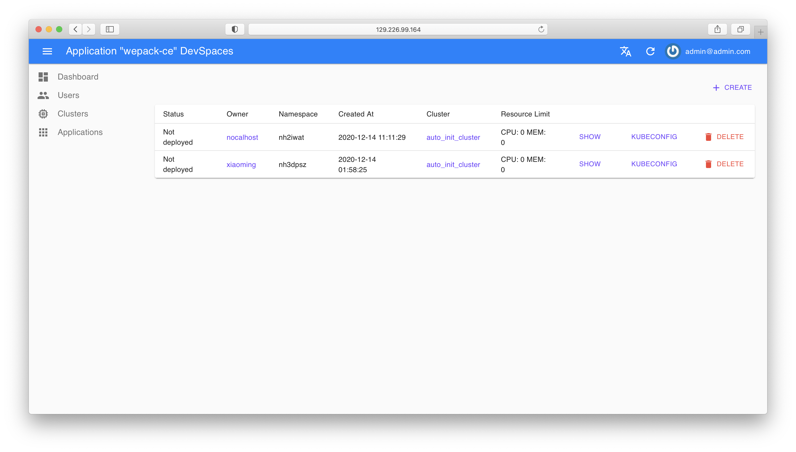
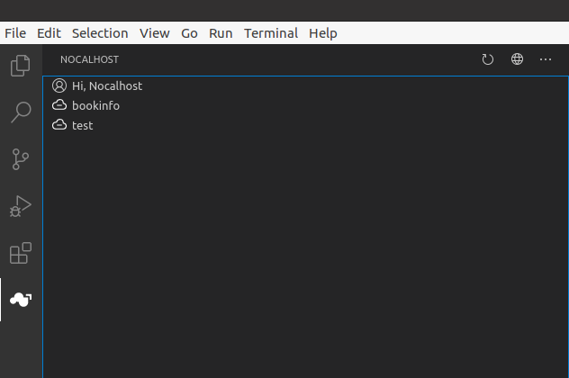

## What is DevSpace

`DevSpace` is a concept of `Nocalhost`, which represents a pre-allocated cloud development space managed by `Nocalhost`. Developers can install, uninstall, develop, and debug applications in DevSpace at any time. DevSpaces are isolated.

In the future, `Nocalhost` will also allow developers to share their DevSpaces with other developers for development collaboration. Because of the isolation of DevSpace, it can also be used as a test environment.

Currently, Nocalhost supports cloud native application development based on Kubernetes. Under the Kubernetes system, DevSpace consists of a Kubernetes `Namespace` and a `ServiceAccount` corresponding to the Namespace. 

In addition, currently DevSpace is only associated with one application and one developer. When creating a DevSpace, you must specify the cluster where the DevSpace is located, the developer to which it belongs, and the associated application.

## How managers manage DevSpace

Nocalhost provides a web console for administrators to create and delete DevSpaces.

## How developers use DevSpace

Developers do not need to log in to the `Nocalhost Web`. After logging in directly in the IDE plug-in, user can get their DevSpace list, which can be easily deployed, uninstalled, developed, and debugged in the plug-in.

## What is User

When you use `Nocalhost-Server` and `Nocalhost-Plug-In`, `User` is used to identify your identity and access control to resources. This `User` belongs to the independent concept of `Nocalhost`, it's different with `kubernetes`'s user.

## What does User do

There are two types of `User` in `Nocalhost`, one is users, users can only log in in IDE Plugin, users can develop under their own `DevSpace`. and these `DevSpace` are all created by the system administrator create.

The other is the system administrator, such as the initial `admin@admin.com`, the system administrator has the permission to access `Nocalhost-Web`, and the system administrator has all the permissions in `Nocalhost-Web`, such as create and manage  ` Application`, `Cluster`,  `User`,  `DevSpace`, etc. 

Similarly, system administrators also have all the permissions of users, such as logging in at `Nocalhost-Plug-In`, develop in their own `DevSpace` list.

## User's permissions

`User` can only see their own `DevSpace`, and have all the permissions under these `DevSpace`, such as `install` and `unInstall` of corresponding `Application` under `DevSpace` , such us deployed, uninstalled, developed, debugged, etc.

In fact, we will also create a `kubeconfig` of the `namespace` corresponding to each `DevSpace` for this `User` to access all resources under `namespace`.

For example, the user currently logged in VSCode Plugin has the permissions of "bookinfo" and "test".

However, users cannot enter `Nocalhost-Web`, nor can they delete the `DevSpace` itself, or disassociate from his `DevSpace`, which is very similar to the `admin` permission under the  `namespace` of k8s.

