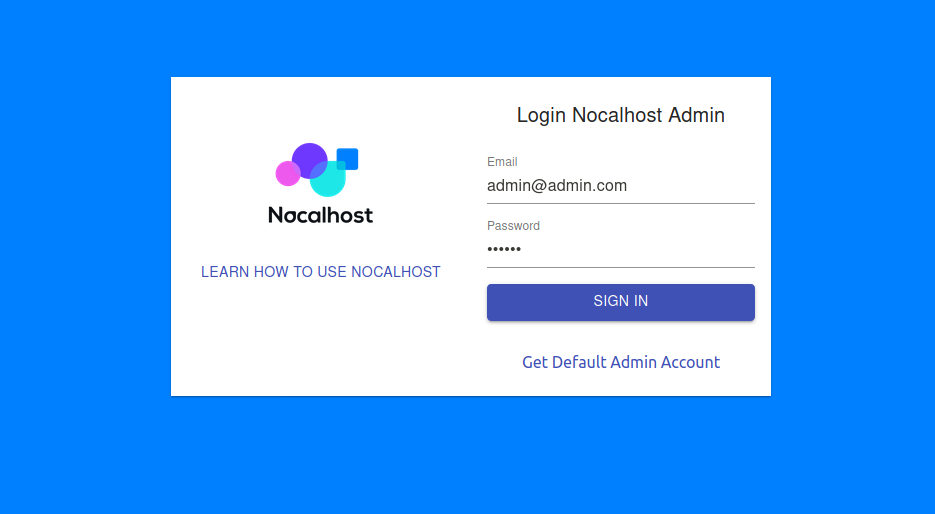
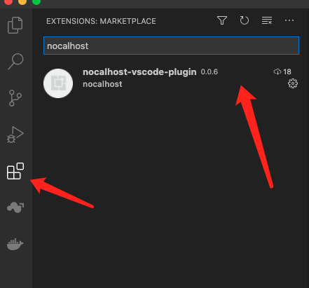
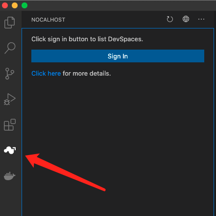
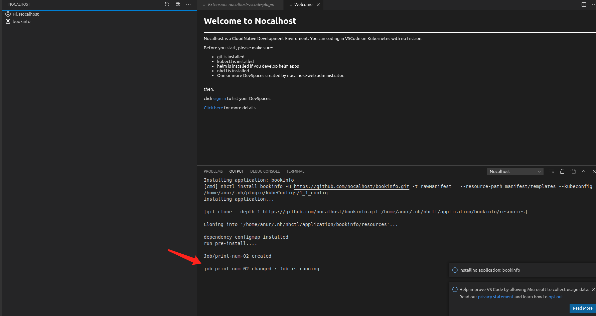
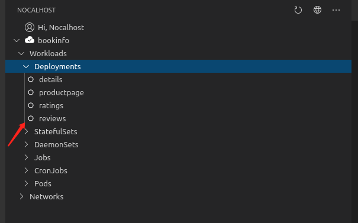
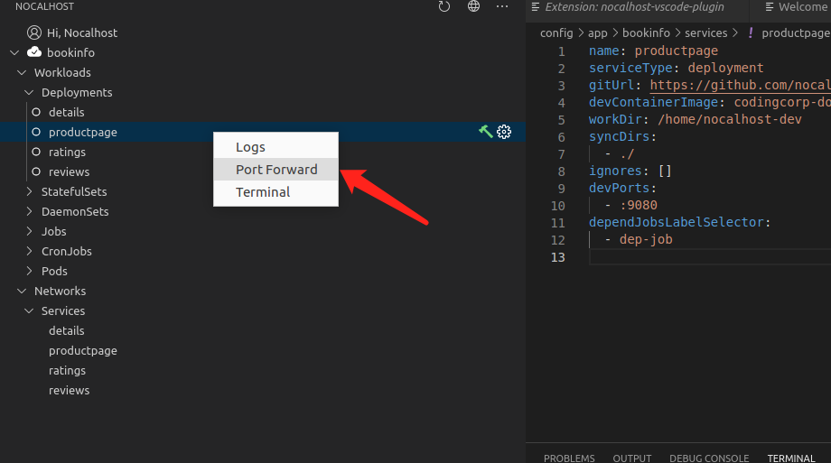
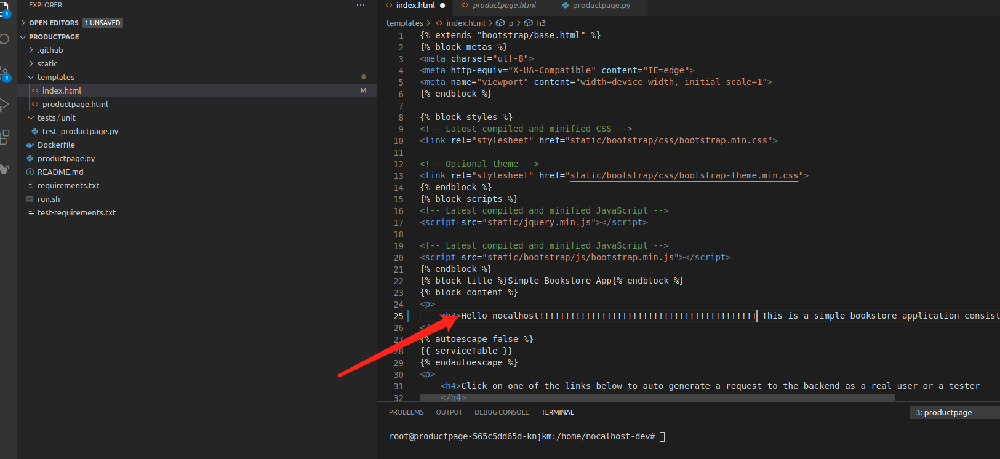
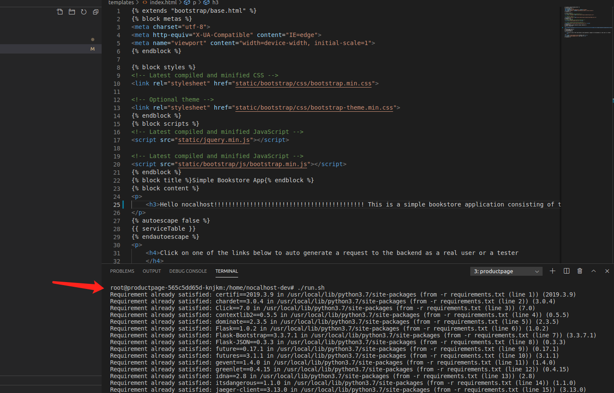
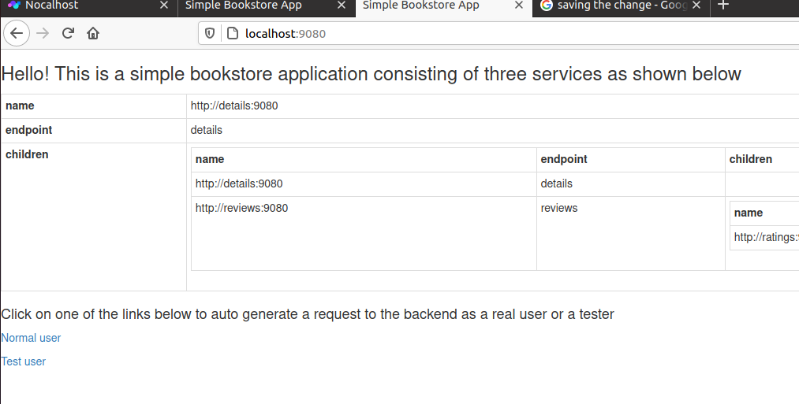

## Prerequisites

To successfully and correctly ensure the use of `Nocalhost` , the following prerequisites needed.

1. [minikube](https://minikube.sigs.k8s.io/docs/start/)
2. [docker](https://www.docker.com/get-started) (we suggest to use docker as driver though `minikube` support dirrent type of driver)
3. [helm3](https://github.com/helm/helm/releases)
4. [kubectl](https://kubernetes.io/docs/tasks/tools/install-kubectl/)
5. [Nhctl v0.0.6+](https://nocalhost.dev/installation/)
6. VSCode
7. [Nocalhost VSCode Plugin v0.0.6+](https://nocalhost.dev/installation/) ( though `Nocalhost` can work order without the plugin, we still recommend using plugin for best experience)

Make sure your `minikube` is up and running. 

```
minikube kubectl version
```

Check `nhctl` , `helm`, `kubectl` too.

```
nhctl version && helm version && kubectl version
```

`nhctl` require kube config file in `$HOME/.kube` named `config`,  or you can specify other kubeconfig files by setting the `--kubeconfig` flag.


## Getting Started

This section will help you to use `nocalhost` for fast-feedback develop. We prepare a Quick-Experience demo,  you don’t have to add any additional configuration. Just init the `nocalhost` and develop in `VSCode` only throughout the experience. 


### STEP1. Init `Nocalhost`

First initial the `Nocalhost` with following command:

​		 `-n` is the namespace `nocalhost` used and it will be auto created

```
nhctl init -n nocalhost
```

Waiting for 5 minutes, the `Nocalhost-Server` and `Nocalhost-Dep` will start and create a Quick-Experience `Application` automatic.


Now we can see multi pods was created in namespace nocalhost and nocalhost-reserved: 

```
> kubectl get pod -n nocalhost

NAME                             READY   STATUS    RESTARTS   AGE
nocalhost-api-5b46855846-9dvzh   1/1     Running   3          22m
nocalhost-mariadb-0              1/1     Running   0          22m
nocalhost-web-5c9b865cf6-sqrrw   1/1     Running   0          22m
```


```
> kubectl get pod -n nocalhost-reserved

NAME                                  READY   STATUS      RESTARTS   AGE
nocalhost-dep-7488b45c7f-bh5p2        1/1     Running     0          20m
nocalhost-dep-installer-9rfm2-t8pgv   0/1     Completed   0          21m
```


### STEP2. Access `nocalhost-web`

`nocalhost-web` is a component of `Nocalhost-Server`, it's a web-based `nocalhost` management designed to store and manage nocalhost applications and configurations.


```
> kubectl get svc -n nocalhost

NAME                TYPE           CLUSTER-IP       EXTERNAL-IP   PORT(S)        AGE
nocalhost-api       ClusterIP      10.108.240.200   <none>        8080/TCP       20m
nocalhost-mariadb   ClusterIP      10.96.11.107     <none>        3306/TCP       20m
nocalhost-web       LoadBalancer   10.101.44.129    <pending>     80:30265/TCP   20m
```

We can see the svc `nocalhost-web`'s port exposed outside with  is 30265, but we can‘t not access it directly right now.


Use [`minikube tunnel`](https://minikube.sigs.k8s.io/docs/handbook/accessing/) 

> `minikube tunnel` runs as a process, creating a network route on the host to the service CIDR of the cluster using the cluster’s IP  address as a gateway.  The tunnel command exposes the external IP  directly to any program running on the host operating system.


Then entering `Nocalhost` homepage with http://`minikube ip`:`nocalhost-web-expose-port`. In this tutorials, `minikube ip` is `192.168.49.2` and `nocalhost-web`'s expose port is 30265.

```
> minikube ip

192.168.49.2
```


So entering `http://192.168.49.2:30265`:

[  ](../assets/images/tutorials/login-web.png){:target="_blank"}


You can login with email `admin@admin.com` pwd `123456` and there is an application sample for Quick-Experience created by `Nocalhost` using the `kubeconfig` you specified when the `Nocalhost` was inited.


### STEP3. Use VSCode Nocalhost Plug-in to install application

This section show how to install your k8s application by using Quick-Experience application bookinfo.


First make sure your plugin has been installed

[  ](../assets/images/tutorials/plugin-how-to-install.png){:target="_blank"}


Switch to the `Nocalhost` tab

[  ](../assets/images/tutorials/plugin.png){:target="_blank"}


Specify your `nocalhost-web` endpoint, and type in the address http://`minikube ip`:`nocalhost-web-expose-port` current used to access `Nocalhost` homepage.

[  ](../assets/images/tutorials/plugin-web-config.png){:target="_blank"}


Sign in with email `foo@nocalhost.dev` and pwd `123456` 


> Why not login with`admin@admin.com`? 

> You can enter the website http://`minikube ip`:`nocalhost-web-expose-port`, switch to the tab `Application`, and there is a `Application` sample named bookinfo.
>
>  click `SPACE LIST` then you can see `Nocalhost` created a `Space` for User `Nocalhost`. That  can be simply understood as `Space` under `Application` is the workspace user can access in the `VSCode Nocalhost Plug-in`.
>
> Of cause you can create a `Space` for user admin manually and sign in with it.


Here show all the `Spaces` hold by the user you sign in. Each spaces can be installed according to your configuration in `Nocalhost-Web`.

[  ](../assets/images/tutorials/plugin-space-list.png){:target="_blank"}

Now click the rocket to install it:

[  ](../assets/images/tutorials/plugin-install-app.png){:target="_blank"}

Waiting for Application startup. 

[  ](../assets/images/tutorials/plugin-waiting-app-up.png){:target="_blank"}

The cycle icon means the resources is already running.

[  ](../assets/images/tutorials/plugin-cycle-status.png){:target="_blank"}

Wait until all pods start up, now forward the port of `Deployment` 'productpage' by right clicking it and select `Port Forward` to access this application on site.

[  ](../assets/images/tutorials/plugin-ports-forward.png){:target="_blank"}


Type in 9080:9080 and press `Enter`

[  ](../assets/images/tutorials/plugin-type-in-port-forward.png){:target="_blank"}


Then we can access 'bookinfo' on site http://localhost:9080


### STEP4. Start develop!

Start develop and entering `Dev-Mode` by clicking one of `Deployment`'s hammer, 'productpage' for example.

[  ](../assets/images/tutorials/plugin-start-develop.png){:target="_blank"}


You can specify your source code dir both local directory or git repo, here we use git repo, and 'productpage''s source code is on  `https://github.com/nocalhost/bookinfo-productpage`, then choose a local directory to clone source code.


Waiting for the dev mode complete startup, `Nocalhost-Plug-In` will open a new window according to the local directory you specified with cloned source code.

> If the source code is already on your machine, you can choose `Open local directory` directly while enter develop by clicking hammer


`Nocalhost` will replace the deployment's container you develop, those files in the directory you specified such as the source code will be synchronized real-time into the container.


Let's modify the `templates/index.html` or something else. **Don't forget to saving the change because nocalhost do not synchronize your change in memory!**

[  ](../assets/images/tutorials/plugin-dev-mode-modify.png){:target="_blank"}


Then run `./run.sh` in the terminal, wait for the app up.

> This step can be any command to start your application, such as:
>
> java Main
>
> gradle build && java -jar ./foo/bar.jar
>
> python helloworld.py

[  ](../assets/images/tutorials/plugin-dev-mode-terminal.png){:target="_blank"}


Access bookinfo on site http://localhost:9080 again, our changes is take effect:

[  ](../assets/images/tutorials/plugin-dev-mode-after-modify.png){:target="_blank"}


`Nocalhost` helps to have a coding experience that almost like develop in the container, so you needn't wait for build images, CI/CD, etc... Just modify your code, and run it.


### STEP5. End develop and uninstall `Application`

Now return to the `Nocalhost-Plug-In`, click the red hammer to end dev mode (may click the `Reresh` icon to synchronize the latest status).

[  ](../assets/images/tutorials/plugin-dev-mode-end.png){:target="_blank"}


While dev mode end, current container replaced before will be restored. Let's access 'bookinfo' on site http://localhost:9080:

[  ](../assets/images/tutorials/plugin-dev-mode-end1.png){:target="_blank"}


Click the bin to uninstall `Application` that all k8s resources in this `Application` will be removed.

[  ](../assets/images/tutorials/plugin-app-uninstall.png){:target="_blank"}


## Configure Application

This section will help you to config an application simply.


Now return to `nocalhost-web`,  entering `Nocalhost` homepage with http://`minikube ip`:`nocalhost-web-expose-port`, login to the `nocalhost-web` using default email admin@admin.com and password 123456.


### STEP1. Create Cluster

First switch to the tab `Clusters`, paste **kube admin config** by using `kubectl.exe config view --minify --raw --flatten` and click on the `Save` button to create a `Cluster`. 

Then we can see:

| Name     | Cluster Version | NodesCount | Users Count | Creator | ...  |
| -------- | --------------- | ---------- | ----------- | ------- | ---- |
| whatever | V1.19.3         | 1          | 0           | Admin   | ...  |


### STEP2. Create Application

After creating `Cluster`, switch to another tab named `Applications`. Create an 'bookinfo' application manually by using following config:

```
Application Name								:		bookinfo
Kubernetes Manifest Source Type :		Git
Manifest Type										:   Helm Chart
Git Repo Url										:		https://github.com/nocalhost/bookinfo.git
Resource Dir										:		charts/bookinfo
```

[bookinfo](https://github.com/nocalhost/bookinfo.git) is a demo project for `nocalhost` , it contain both manifest type `Kubenetes manifests` and `helm manifests`, we use `Helm manifests` and specify it's manifest resource dir `charts/bookinfo`.  (or you can use `Kubenetes manifests` with resource Dir `manifest/templates`)

| Application Name | Kubernetes Manifest Source Type | Creator | ...  |
| ---------------- | ------------------------------- | ------- | ---- |
| bookinfo         | Git                             | Admin   | ...  |


### STEP3. Create Space

At last, create a `Space` for this `Application`, choose a `Cluster` created before and specify it's owner: 

| Status | Owner | Namespace | Created At          | Cluster  | ...  |
| ------ | ----- | --------- | ------------------- | -------- | ---- |
|        | Admin | Nh1hsbq   | 2020-12-11 00:00:00 | Whatever | ...  |


then `nocalhost` use `kubenetes config` from `Cluster` to create a `kubernates namespace`. This namespace use for installing application when develop on `Nocalhost-Plug-In`.