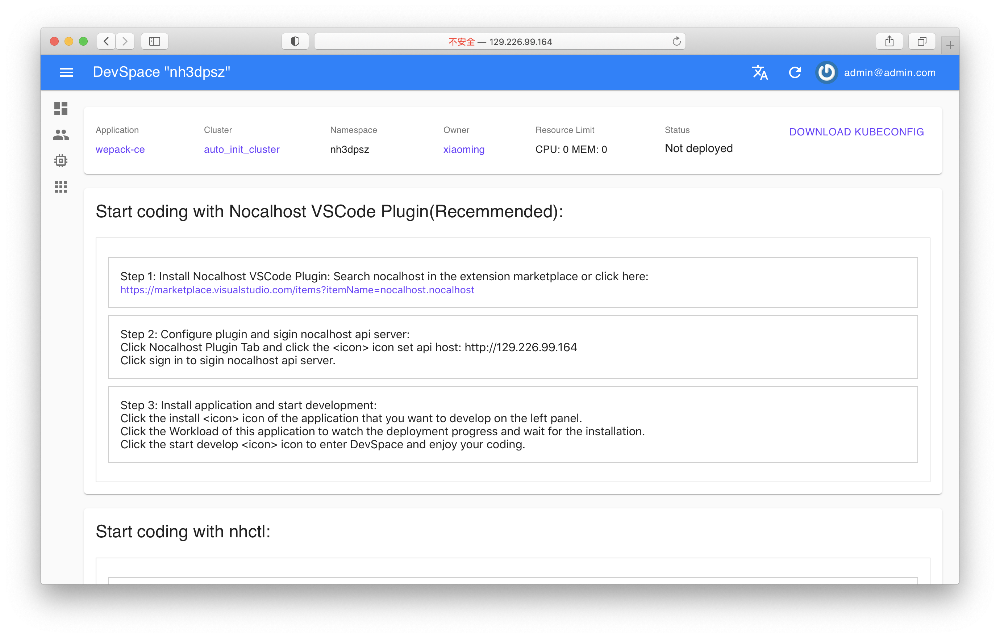

# Start coding with nhctl

1. Install nhctl: [https://nocalhost.dev/installation](/installation)

2. Get "kubeconfig" file from Kubernetes Administrator or download from Nocalhost Web and save to local machine.

[  ](../assets/images/download-kubeconfig.png){:target="_blank"}


3. Install an application that you want to develop via nhctl:
```bash
nhctl install <application name> --kubeconfig <kubeconfig> -u <a git repo url which contains helm chart or manifests>  
```

4. After installation,you can enter DevMode by specify a workload that you want to develop:
```bash
nhctl dev start <application name> --kubeconfig <kubeconfig> -d <the workload that you want to develop>  
```

5. Once DevMode established, codes can be transfered to DevContainer by running nhctl sync command:
```bash
nhctl sync <application name> --kubeconfig <kubeconfig> -d <the workload that you want to develop>  
```

6. Forwarding ports from DevContainer to local is a optional operation if you want access container locally:
```bash
nhctl port-forward <application name> --kubeconfig <kubeconfig> -d <the workload that you want to develop>
```

7. Now, you can make some code changes and start your program process in DevContainer:
```bash
nhctl dev terminal <application name> --kubeconfig <kubeconfig> -d <the workload that you want to develop>
<your program start command,like: ./gradlew bootRun>
```

!!! note
	[Click here](/References/cli-commands) to get more details about the arguments of nhctl
