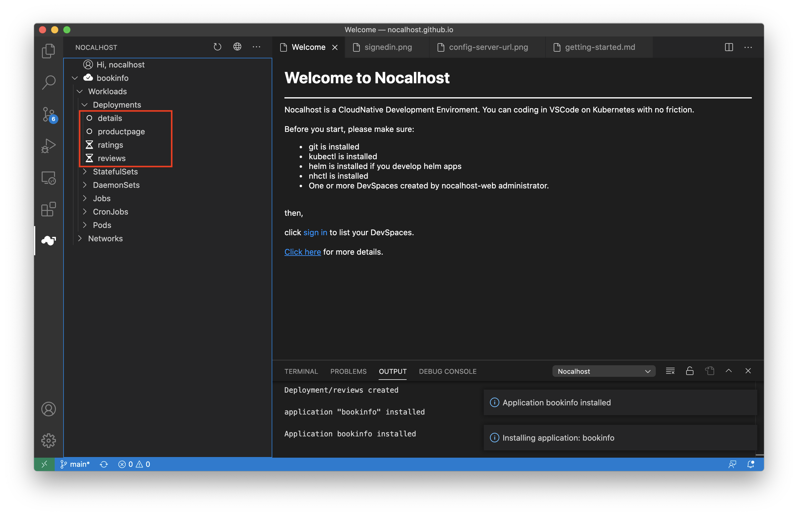
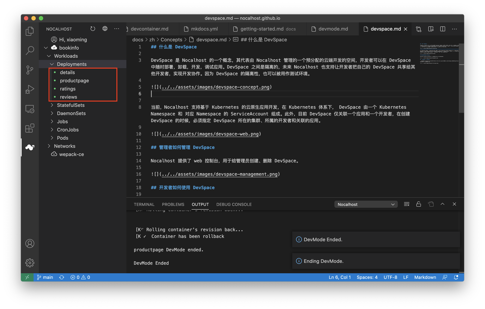
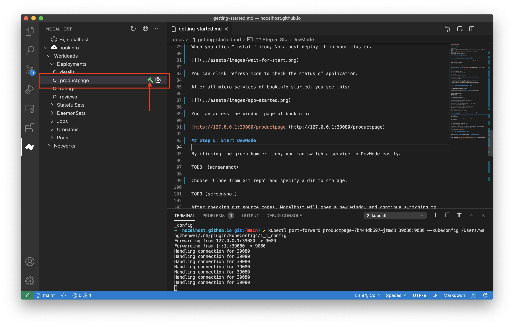
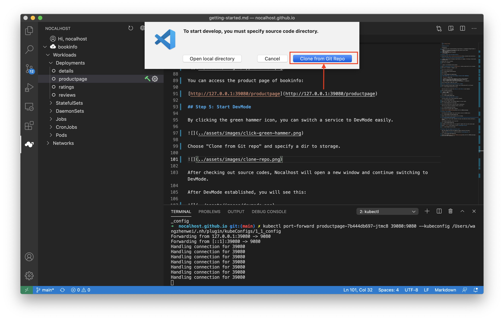
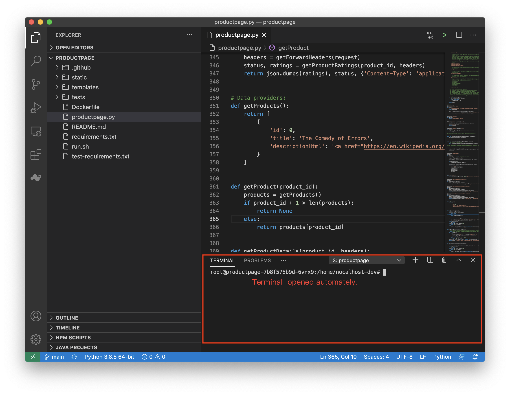
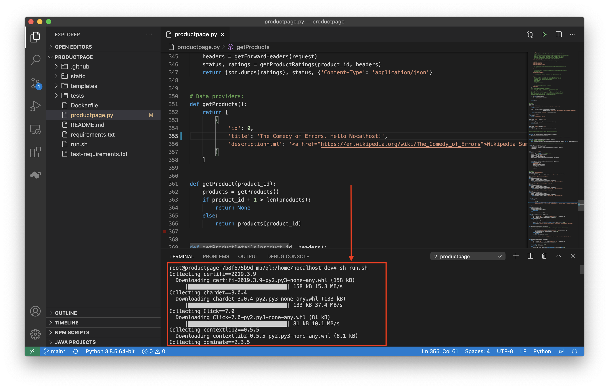
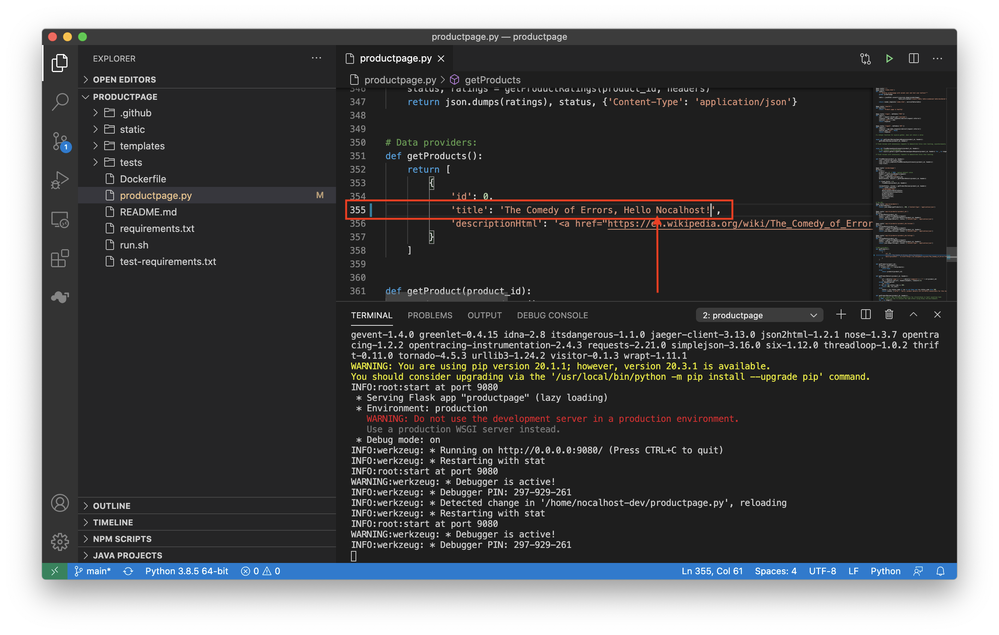
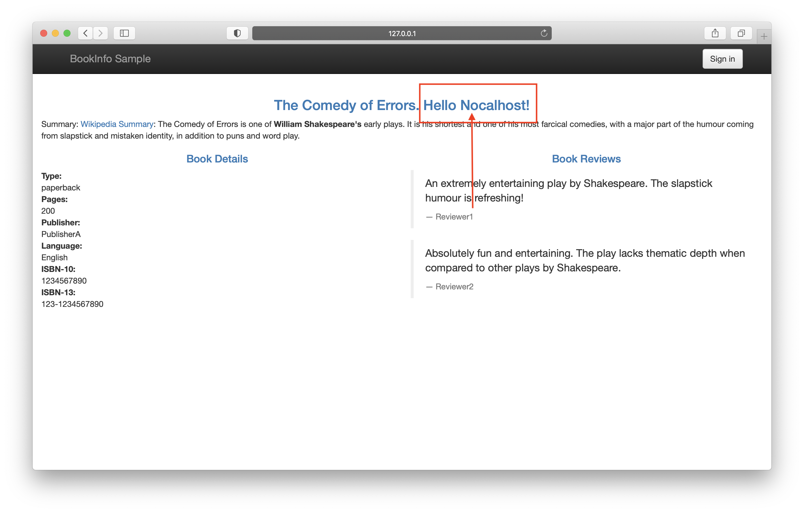

## Before you start

Prerequisites:

- A Kubernetes(1.16+) Cluster(Provided by Cloud Platform is recommended although Minikube is fine).
- kubectl is installed and configured with admin access to your cluster.
- RBAC must be enabled on your cluster.
- Helm3 installed.
- Visual Studio Code(1.31+) installed.
- Git installed.

## Step 1: Install nhctl and VSCode extension

Follow this link: [https://nocalhost.dev/installation/](https://nocalhost.dev/installation/){:target="_blank"}

## Step 2: Initialize the cluster and setup Nocalhost Server

- Option 1: Init Cluster provided by cloud platform, for example: [TKE](https://cloud.tencent.com/product/tke){:target="_blank"} :

Execute nhctl init in terminal:
```
nhctl init -n nocalhost
```

- Option 2: Init Minikube drived by docker:

After **minikube(docker driver)**(`minikube start --driver=docker`) started, execute nhctl init in terminal:
```
nhctl init -n nocalhost -t nodeport -p 80
```

Wait for the starting process:


After started:


**[FOR MINIKUBE ONLY]: DO NOT CLOSE THIS TERMINAL WINDOW TO KEEP THE PORT FORWARDING**

!!! note " `nhctl init` command flags"
    - --namespace: to specify which namespace to install.(create automately)
    - --port: to specify which port Nocalhost Web to listen.(Default 80)
    - --set: to overide values for Nocalhost's Helm Chart
    - --type: to specify service type of Nocalhost Web(nodeport or loadbalaner)
    You can config flags to adapt your cluster.
    - --force: force to init, be careful it will remove all nocalhost old data

## Step 3: Configure and login Nocalhost Server in VSCode

Enter the Nocalhost Extension page in VSCode, click "Config Server URL" on left panel:


Paste the access url you get from **Step 2**, for example, if you use minikube you should enter fixed address: `http://127.0.0.1:31219`, hit **Enter** on your keyboard.

Enter username and password:

- username: foo@nocalhost.dev
- password: 123456

After signed in, you see this:


## Step 4: Install demo application: bookinfo

Click the install icon to install application: bookinfo.


When you click "install" icon, Nocalhost deploy it in your cluster.



You can click refresh icon to check the status of application.

After all micro services of bookinfo started, you see this:



Now, you can access the product page of bookinfo: 

[http://127.0.0.1:39080/productpage](http://127.0.0.1:39080/productpage)


## Step 5: Start DevMode

By clicking the green hammer icon, you can switch a service to DevMode.



Choose "Clone from Git repo" and specify a dir to storage.



After checking out source codes, Nocalhost will open a new window and continue switching to DevMode.

After DevMode established, you will see this:



In DevMode, the dev container will not respond for requests until you start process again.

Execute `sh run.sh` in dev container to start **productpage service** in hot-reloading mode:



## Step 6: Make code changes and check the result

Make code changes and refresh the web page you opened to check out the result.

Example, add **Hello Nocalhost!** here in line 355 of **productpage.py**. Don't forget to save the file. 😎 



Refresh the webpage [http://127.0.0.1:39080/productpage](http://127.0.0.1:39080/productpage){:target="_blank"} , you will see the code change result immediately. 😄



# Congratulations!

By this tutorial based on Nocalhost, you've experienced the convenience and power of cloud native development. Try to use it in real projects!

Any questions and contributions are welcomed. GitHub Issue: [https://github.com/nocalhost/nocalhost](https://github.com/nocalhost/nocalhost){:target="_blank"}