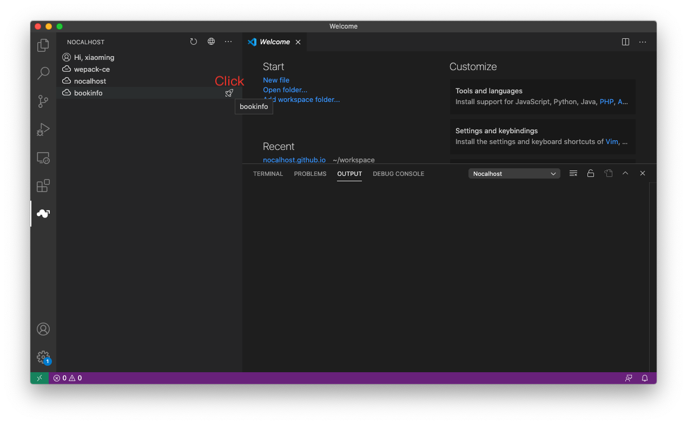

## Before you start

You need prepare some prerequisites before coding with Nocalhost:

- A Kubernetes Cluster(Provided by Cloud Platform is recommended although Minikube is fine.).
- kubectl is installed and configured with admin access to your cluster.
- RBAC must be enabled on your cluster.
- A Kubernetes natived application organized by Helm or raw manifests in Git repository.
- Helm installed.
- Visual Studio Code installed.
- Git installed.

## Step 1: Install nhctl

You can follow this link to install nhctl: [https://nocalhost.dev/installation/](https://nocalhost.dev/installation/)

## Step 2: Initialize the cluster and setup Nocalhost Server

## Step 3: Install VSCode Extension of Nocalhost

You can follow this linkt to install the extension: [https://marketplace.visualstudio.com/items?itemName=nocalhost.nocalhost](https://marketplace.visualstudio.com/items?itemName=nocalhost.nocalhost)

## Step 4: Configure and login Nocalhost Server in VSCode

Enter the Nocalhost Extension page in VSCode, click "Config Server Url":

Paste the access url you get from **Step 2**, hit **Enter** on your keyboard.

Click "Sign in" button and enter the username you get from **Step 2**, hit **Enter** on your keyboard.
Enter the password you get from **Step2**, hit **Enter** on your keyboard.

After signed in, you see this:

TODO （screenshot）

## Step 5: Install demo application: bookinfo

Click the install icon to install application: bookinfo.

When you click "install" icon, Nocalhost deploy it in your cluster. You can click refresh icon to check the status of application.

After all micro services of bookinfo started, you see this:

TODO （screenshot）

You can access the web page of bookinfo: 

TODO （screenshot）

## Step 6: Start DevMode

By clicking the green hammer icon, you can switch a service to DevMode easily.

TODO （screenshot）

Choose "Clone source codes from Git repo" and specify a dir to storage.

TODO (screenshot)

After checking out source codes, Nocalhost will open a new window and continue switching to DevMode.

After DevMode established, you will see this:

TODO (screenshot)

## Step 7: Make code changes and check the result

Make code changes and refresh the webpage you opend to check out the results.

Example, add "Hello Nocalhost!" here in line 355 of productpage.py 😎. 

Refresh the webpage, you see the result immediately 😊.
