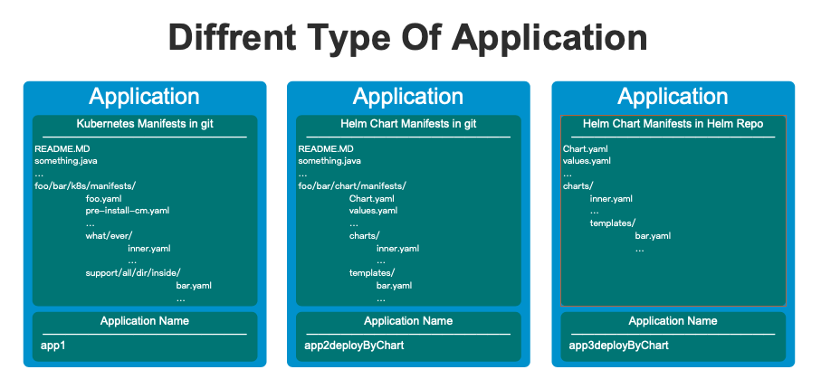
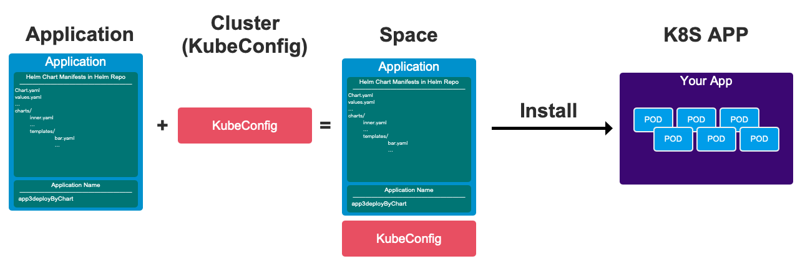

## 什么是 Application

`Application` 是 `Nocalhost` 的一个概念，它主要用于管理你想用于本地开发的一组 manifest 文件，同时支持 k8s manifest 和 helm chart。也就是说，这些 manifest 通常包含你的应用所依赖的所有 k8s 资源，如果可能，我们应该尽量保持它的最小化。


`Application` 支持放置在 `git` 的 `k8s manifest`，放置在 `git` 的 `helm chart` 和直接放置在 `Helm Repo` 几种方式，未来会添加对 `kustomize` 的支持。 



## Application 是做什么的

`Application` 可以用于创建 `DevSpace`，我们推荐使用 IDE 插件来直接使用并部署你的应用，**插件正是基于 `DevSpace` 进行应用部署的**。也就是说，开发者在被分配一个 `DevSpace`后，就可以便捷地在 IDE 上进行开发。


在被分配`DevSpace` 后，会得到一个用以访问这个 `DevSpace` 的 `kubeconfig`，`nhctl` 或者插件可以根据应用的 `manifest` 文件和 `kubeconfig` 来启动应用。


`Application` 也是这样被使用的，`DevSpace` 其实可以近似看作 `Application` + `kubeconfig`：



## Application 与 Manifest

### 对于 Helm Manifest 的支持

`nocalhost` 支持使用 helm，**无需对 chart 做任何改造**.


#### 1. 如果你已经拥有并且正在使用 Helm Chart：

```
helm install helloworld /chart/dir/ \ 
   -n fooNamespace \
   --kubeconfig ~/.kube/barconfig
```


只需要花费一点时间，将你的 Helm Chart 放置在任意一个你有权限访问 git 仓库即可，我们会使用 git clone 命令来获取最新的 Application 信息，例如：

```
https://[gihub, Gitlab, etc... whateverRepo]/foo/bar/hellowrold.git

Somefile.py
AClass.java
README.MD
...
mychart/dir/
   Chart.yaml
   values.yaml
   charts/
   templates/
   ...
```

对于这个仓库来说，我们将 Helm chart 放置在了 **相对于根目录** 的 mychart/dir/ 文件下，那么我们可以使用如下命令来进行体验：

```
nhctl install helloworld \
   -u https://[gihub, Gitlab, etc... whateverRepo]/foo/bar/hellowrold.git \
   -t helmGit \
   -n k8sFooNamespace \
   --resource-path charts/bookinfo \
   --kubeconfig ~/.kube/barconfig
```

#### 2. 如果拥有自己的 Helm Repo：

```
helm install helloworld \
   mychart \
	 -- repo http://mychart/charts/ \
   -n fooNamespace \
   --kubeconfig ~/.kube/barconfig
```

你可以使用如下命令来达到同样的效果：

```
nhctl install helloworld \
   --helm-chart-name mychart \
   --helm-repo-url http://mychart/charts/ \ 
   -n fooNamespace \
   --kubeconfig ~/.kube/barconfig
```

### 对于 Kubernetes Manifest 的支持

`nocalhost` 也可以无缝支持 `Kubernetes Manifest`，同样无需你对配置做任何改造，不过我们需要你将其上传到任意一个 git 仓库：

假设你有这样的一个仓库，它的地址为 `https://[gihub, Gitlab, etc... whateverRepo]/foo/bar/hellowrold.git`，里面存放着许多 `Kubernetes Manifest` yaml 文件 ：

```
README.MD
something.java
…
foo/bar/k8s/manifests/
                 			foo.yaml
                 			pre-install-cm.yaml
                		 	…
                 			what/ever/
                               inner.yaml
                               …
                		  support/all/dir/inside/
                                            bar.yaml
                                            …
```

你只想应用相对根目录 `what/ever/` 与 `support/all/dir/inside/` 下的文件，那么使用命令：

```
nhctl install applicationNameFooBar \
  -u https://[gihub, Gitlab, etc... whateverRepo]/foo/bar/hellowrold.git \
  -t manifest \ 
  -n k8sFooNamespace \
  --resource-path what/ever/ \
  --resource-path support/all/dir/inside/ \
  --kubeconfig ~/.kube/barconfig
```

如果你想应用所有文件，则可以使用命令：

```
nhctl install applicationNameFooBar \
  -u https://[gihub, Gitlab, etc... whateverRepo]/foo/bar/hellowrold.git \
  -t manifest \ 
  -n k8sFooNamespace \
  --resource-path . \
  --kubeconfig ~/.kube/barconfig
```

## `Nocalhost` 对原生 Application 的增强

`Nocalhost` 对用户的 k8s manifest 配置无侵入，如果你需要使用一些增强功能，例如 `Pre-Install`、例如依赖管理等。在你的仓库下新增 `.nocalhost/` 文件夹，并新增 [config.yaml](https://github.com/nocalhost/bookinfo/blob/main/.nocalhost/config.yaml) 。


### Pre-Install

我们允许用户在安装部署应用之前，进行一些额外的操作。以 [bookinfo](https://github.com/nocalhost/bookinfo) 为例，在安装应用前，我们会执行如下声明的几个 Job，等待 Job 执行结束才安装应用，

```
onPreInstall:
  - path: manifest/templates/pre-install/print-num-job-01.yaml
    weight: "1"
  - path: manifest/templates/pre-install/print-num-job-02.yaml
    weight: "-5"
```

### 启动依赖管理

`Nocalhost` 可以控制应用内的服务启动顺序。

例如以下这个配置，代表 `reviews` 这个 `deployment`，需要等待 `productpage` 的 `pod` 可用才会启动。

```
services:
  - name: reviews
    serviceType: deployment
    gitUrl: https://github.com/nocalhost/bookinfo-reviews.git
    devContainerImage: codingcorp-docker.pkg.coding.net/nocalhost/dev-images/java:latest
    workDir: /home/nocalhost-dev
    syncDirs:
    - ./
    dependPodsLabelSelector:
    - "productpage"
```

可以点击 [启动依赖管理](https://nocalhost.dev/zh/Concepts/service/#2) 来查看更多。

### 开发镜像配置

上述配置中，`devContainerImage: codingcorp-docker.pkg.coding.net/nocalhost/dev-images/java:latest`，代表你在进入开发模式时，使用此镜像作为容器，替代原镜像进行开发。

### 更多

如果你想了解 `.nocalhost/` 的更多配置信息，点击：[/zh/References/nocalhost-config-yaml-spec/](/zh/References/nocalhost-config-yaml-spec/)。

## Application 的最佳实践

通常，我们推荐使用 `Nocalhost-Server` + IDE 插件配合使用。虽然 `nhctl` 能处理所有事情，但命令行操作使用繁琐，我们并不推荐直接使用 `nhctl` 来直接进行应用的部署、开发等。虽然上面的很多示例都直接使用 `nhctl` 来说明。


用上面这个例子为例，直接进入 `Nocalhost-Web` 来进行创建。进入主页后，切换到 Applications 这一栏，点击右上角进行创建：


支持前面分别提到的三种形式，这里以 `kubernetes manifest` 为例：


## Advance

这里会说明一些 `Application` 一些额外的特性或者设计，这并不是必须的，但会有助于你更好的使用 Nocalhost。

### Application Name

nocalhost 使用唯一的 Application Name 来区分不同的 Application。注意，即使使用不同的 `Nocalhost-Server`（例如部署了两套以上的 `Nocalhost-Server`），不支持相同的 `Application Name` 在同一个开发机器上使用。

### `~/.nh` 下的 `Application`

注意，`~/.nh/` 目录下，`nhctl` 和 IDE 插件会存储一些文件用以保存当前应用部署，开发等的一些状态，通常你不需要了解或者直接使用他们。

