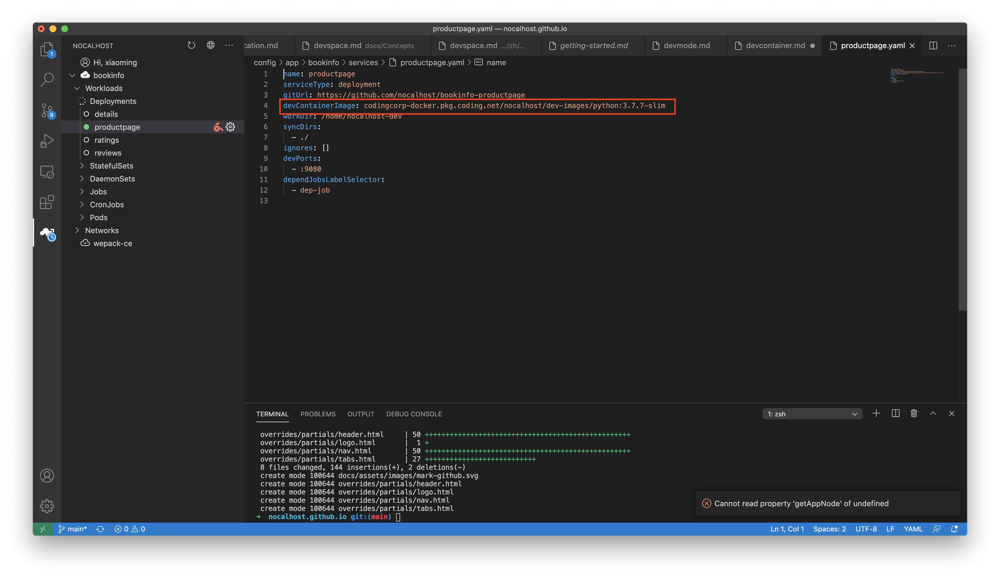

## 什么是 DevContainer

DevContainer 是一个用户支撑开发、调试某个特定微服务组件的基础环境，此环境被封装成一个容器，内常含有开发该微服务组件的全套 SDK，开发调试工具，以及其他辅助工具。
在服务的工作负载被切换到 [DevMode](https://nocalhost.dev/zh/Concepts/devmode/){:target="_blank"} 的时候，Nocalhost 会使用 DevContainer 替换原本工作负载的容器。

## 如何配置 DevContainer

在 Nocalhost 的配置文件中，给对应的 service 添加 devContainerImage 字段即可。

{:target="_blank"}

在 Nocalhost 控制 Pod 进入 DevMode 的时候，设置的 devContainerImage 会被启动成为 DevContainer 替代原本的容器。之后，开发者可以在 DevContainer 中构建，运行，调试自己的程序了。

Nocalhost 会将 DevContainer 的启动命令覆盖为 `/bin/sh -c tail -f /dev/null` 以确保 DevContainer 不会意外退出。关于 DevMode 下，Nocalhost 做的其他变动，请查看：[DevMode](https://nocalhost.dev/zh/Concepts/devmode/){:target="_blank"}

## Nocalhost 提供的 DevContainer Image

[https://github.com/nocalhost/dev-container](https://github.com/nocalhost/dev-container){:target="_blank"}

## 关于 DevContainer Image 制作的建议

你可以使用任何 Docker Image 来作为 DevContainer Image，只要他包含基本的 shell (/bin/sh) 即可。

但在实际使用中，我们强烈建议为特定技术栈的服务提供专属的 DevContainer Image。一个好的 DevContainer Image 应该：

- 提供易用的 shell，如：bash,zsh 等
- 提供构建源码所需的基础 SDK，如 JDK
- 提供构建源码所需的工具链，如 git，maven，yarn，make 等
- 提供构建源码所需的第三方依赖包或者自动下载配置，如配置 Maven 镜像源
- 提供开发过程需要的其他调试工具，如 gdb，curl，tcpdump，mysql-client 等
- 不要包含服务的源代码（源代码应该通过源码管理系统检出到本地，并同步到 DevContainer 中。）
