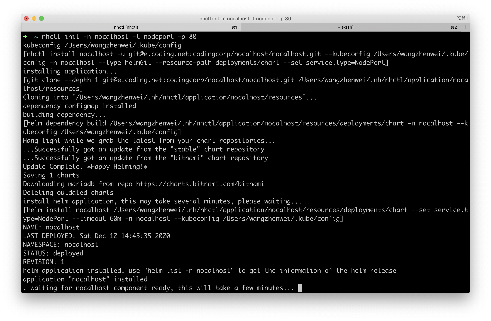
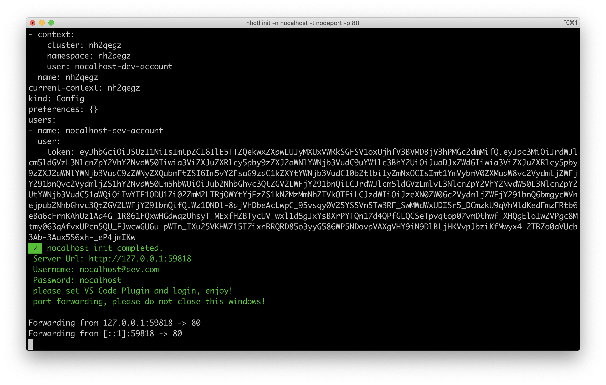
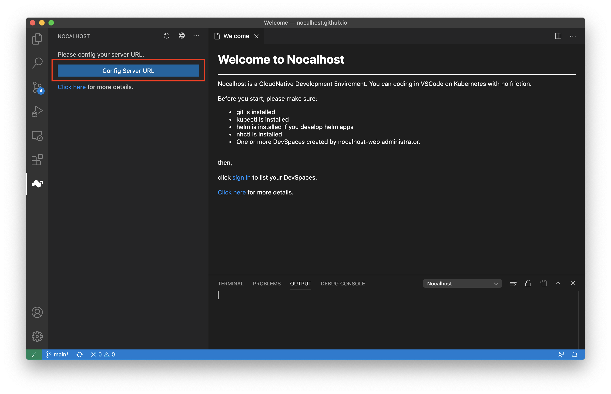
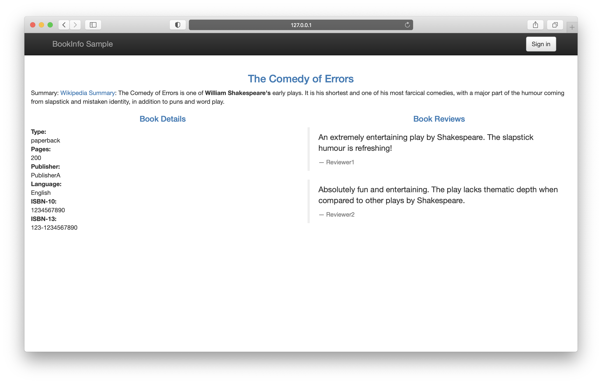

## 开始之前

前置条件:

- 一个 Kubernetes(1.16+) 集群(建议由云平台提供，Minikube 也可以)
- 配置好 kubectl 可以以管理员身份访问上述集群
- 集群必须启用 RBAC
- 安装好 Helm3
- 安装好 Visual Studio Code(1.31+) 
- 安装好 Git

## 第一步: 安装 nhctl 和 VSCode extension

参考这里: [https://nocalhost.dev/installation/](https://nocalhost.dev/installation/)

## 第二步: 初始化集群并且部署 Nocalhost Server

- 可选由云平台提供的 Kubernetes: 如 [腾讯 TKE](https://cloud.tencent.com/product/tke) :

在命令行终端执行初始化:
```
nhctl init -n nocalhost
```

- 或者使用 Minikube: 以 docker 模式启动 minikube:

在 **minikube(docker driver)**(`minikube start --driver=docker`) 启动完毕, 在命令行终端执行初始化:
```
nhctl init -n nocalhost -t nodeport -p 80
```

等待初始化过程:



初始化完毕后:



**[MINIKUBE 方案注意]: 为了保持端口转发，请不要关闭上述 Terminal**

!!! note " `nhctl init` 命令行参数"
    - --namespace: 指定安装在哪个集群.(会自动创建不存在的集群)
    - --port: 指定 Nocalhost Web 监听的端口.(默认是 80)
    - --set: 指定覆盖 Nocalhost Helm Chart 的 value
    - --type: 指定 Nocalhost Web 的 Service Type(nodeport or loadbalaner)
    --force: 强制初始化，请注意它将删除所有 Nocalhost 的旧数据

    你可以根据你的集群情况，配置上述 init 参数来执行初始化过程.

## 第三步: 配置并登陆 Nocalhost VSCode 插件

在 VSCode 中进入插件页面, 在左侧面板中点击 "Config Server URL" 按钮:




输入从 **第二步** 获得的访问地址, 如果你使用的是 `Minikube`，那么可以输入固定地址 `http://127.0.0.1:31219`，按下回车键保存.

分别输入用户名和密码，按下回车键保存:

- 用户名: foo@nocalhost.dev
- 密码: 123456

在登录之后，你可以看到:


## 第四步: 安装示例应用: bookinfo

点击左侧面板上的安装图标，安装应用: bookinfo.


点击之后，Nocalhost 会开始执行安装过程.


你可以点击刷新图标来查看应用安装和启动过程中的状态变化。

在所有微服务都启动完毕后，你可以看到：


现在，你可以访问安装的应用的 web 页面了：

[http://127.0.0.1:39080/productpage](http://127.0.0.1:39080/productpage)



## Step 5: Start DevMode

你可以点击某个工作负载的绿色锤子图标来把工作负载切换到开发模式.


你选择 "Clone from Git repo" 并指定一个本地存储目录后，Nocalhost 会把源码 clone 下来.


源代码检出后, Nocalhost 会打开一个新 VSCode 窗口，并继续切换到开发模式.

在开发模式切换（初次使用，时间可能较长）完毕后，你会看到:


在开发模式下，开发容器默认没有启动主进程，所以不会响应网页端的请求，此事如果刷新页面，页面将出错。直到你再次启动进程后，页面才会恢复。

如果你切换开发模式的工作负载是 productpage 的话，你可以执行 `sh run.sh` 来启动 hot-reload 模式的进程:


## 第六步: 改动一些代码，并查看运行结果

你可以尝试修改一些代码，并刷新页面看效果。

例如, 在文件 **productpage.py** 的 355 行添加 **Hello Nocalhost!** . 别忘了保存文件.


刷新网页，即可立即看到效果。 [http://127.0.0.1:39080/productpage](http://127.0.0.1:39080/productpage) 😄


# 恭喜!

通过这个简单的基于 Nocalhost 的教程，你已经体验了云原生开发的便捷和强大。可以开始尝试在真实的项目中配置并使用 Nocalhost 了。

Nocalhost 欢迎您的意见和建议. GitHub Issues: [https://github.com/nocalhost/nocalhost](https://github.com/nocalhost/nocalhost)